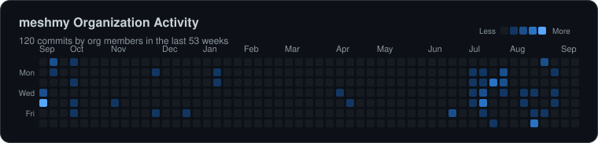

# Mesh Malaysia

**LoRa mesh users Malaysia 🇲🇾**

📍 Malaysia · 🔗 [linktr.ee/meshmy](https://linktr.ee/meshmy)

---

## 📡 Org Activity

<!-- ACTIVITY:START -->
<picture>
  <source media="(prefers-color-scheme: dark)" srcset="activity-graph-dark.svg" />
  <source media="(prefers-color-scheme: light)" srcset="activity-graph-light.svg" />
  
</picture>
<!-- ACTIVITY:END -->

## 📦 Repositories

<!-- REPOS:START -->
<table>
  <tr>
    <td valign="top" width="50%">
      <h3>🕒 Recently Active</h3>
      <ol>
        <li><a href="https://github.com/meshmy/meshmy.github.io"><b>meshmy.github.io</b></a> The MeshMY community website last org activity: 2026-09-24</li>
        <li><a href="https://github.com/meshmy/meshtastic-db"><b>meshtastic-db</b></a> Self-hosted TimescaleDB + Grafana ingest stack for Meshtastic mesh telemetry last org activity: 2026-09-24</li>
        <li><a href="https://github.com/meshmy/meshtastic-firmware"><b>meshtastic-firmware</b></a> Meshtastic device firmware last org activity: 2026-09-03</li>
        <li><a href="https://github.com/meshmy/meshtastic-docs"><b>meshtastic-docs</b></a> Meshtastic project website and documentation last org activity: 2026-08-31</li>
        <li><a href="https://github.com/meshmy/meshtastic-web-flasher"><b>meshtastic-web-flasher</b></a> Official online flasher for Meshtastic device firmware last org activity: 2026-08-29</li>
      </ol>
    </td>
    <td valign="top" width="50%">
      <h3>🔥 Top by Engagement</h3>
      <ol>
        <li><a href="https://github.com/meshmy/meshtastic-config-my-sg"><b>meshtastic-config-my-sg</b></a> Meshtastic Configuration for Malaysia and Singapore engagement score: 9</li>
        <li><a href="https://github.com/meshmy/meshtastic-firmware"><b>meshtastic-firmware</b></a> Meshtastic device firmware engagement score: 4</li>
        <li><a href="https://github.com/meshmy/radiosondetastic"><b>radiosondetastic</b></a> we need a better name engagement score: 4</li>
        <li><a href="https://github.com/meshmy/meshmy.github.io"><b>meshmy.github.io</b></a> The MeshMY community website engagement score: 3</li>
        <li><a href="https://github.com/meshmy/russell"><b>russell</b></a> Russell is a board designed to mount on an ER34615/IFR32700 cell and go Up! on a balloon engagement score: 2</li>
      </ol>
    </td>
  </tr>
</table>
<!-- REPOS:END -->

This page and the charts above are regenerated automatically by a scheduled GitHub Action — see <a href="https://github.com/meshmy/.github/tree/main/.github/workflows/update-profile.yml">update-profile.yml</a>.
